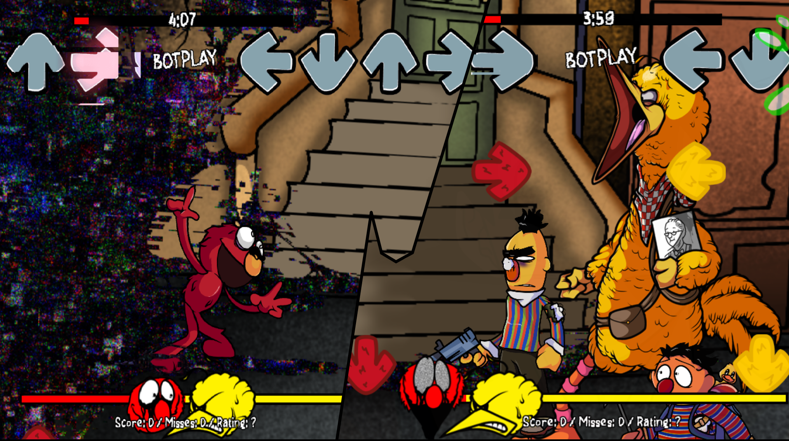

> **Note**: I am yet to receive any large/meaningful work for Broken Strings, but hopefully you'll see my work in the finished product!

One of my favorite mods that I am currently working on, features phenomenal music and an exceptional team. As of March 13, 2025, the date of me writing this, I am pleased to note that there has been no drama, and everyone involved has demonstrated remarkable humor and professionalism.

