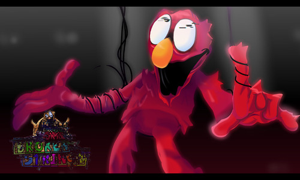

> **Note**: This description is an AI-generated synopsis.

excerpt: "FNF: Broken Strings is an upcoming mod for the popular rhythm game Friday Night Funkin'. Created by ThoMitDraws, this mod is inspired by various puppet and costumed character shows like Don't Hug Me I'm Scared, Sesame Street, The Muppets, and more. The mod features a series of songs where players face off against corrupted versions of beloved characters from these shows.
<figure>
 
</figure>"
