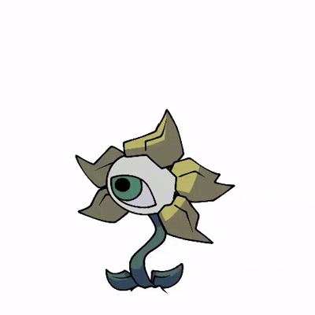

> **Note**: Most of my work was replaced for this, but was redesigned with my supervision!

One of my more popularized mods, at first i honestly didnt expect this to blow up like it did.The mod team had ups and downs, but over-all it was fun to be a part of! I did mostly concept animation and coding for all the stages, I also did concepts for the stages but i'm honestly unaware if they were revised or kept ;-; I'm assuming they were kept due to an event still happening to the bopping characters during Slasher's Feast.
